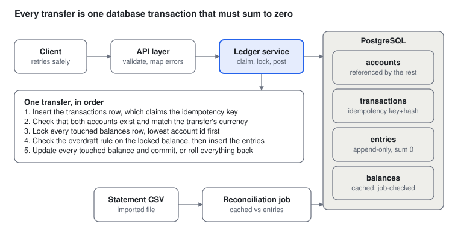

# Ledger Service Design

## Purpose

A small double-entry ledger service that shows how to keep money correct under retries, concurrency, and failures: idempotent transfers, row-level locking, append-only entries, and reconciliation. It is a portfolio project, so there is no UI, no real money, and no users.

## Scope and stack

The service records money movements between accounts and guarantees they balance; it does not move real money.

| In scope | Out of scope |
| --- | --- |
| Accounts and double-entry transactions | User login and permissions |
| Idempotent transfer API | Any UI |
| Cached balances verified against immutable entries | Real payment networks or cards |
| Reversals as new compensating entries | Currency conversion (stretch goal) |
| Concurrency safety and reconciliation | Multi-region or sharding (discuss only) |
| Tests, CI, load test, README | Production deployment |

**Stack:** Python 3 with FastAPI, PostgreSQL, pytest with Hypothesis, Docker Compose, GitHub Actions.

**Stack decisions:**

- **Language:** Python 3 (decided; Java with Spring Boot was the considered alternative).
- **Database access:** raw SQL, no ORM, so locking and isolation levels are explicit and easy to explain.
- **Concurrency model:** synchronous handlers. Concurrency tests still fire parallel requests with threads.
- **Connection pool:** `psycopg_pool`, a fixed pool of 10 connections, with the handler thread pool set to 20 at startup (FastAPI's default is 40). The extra threads wait on the pool with a timeout, so a request that cannot get a connection becomes a bounded 503. The thread limit alone does not bound queueing, because requests beyond 20 in flight wait for a handler thread with no timeout, so the service also has an overall concurrency cap that rejects requests above it with a 503 (uvicorn's `--limit-concurrency`, or a small middleware). Both sizes come from environment variables, and the values used are recorded with every benchmark. A request uses one connection for its whole transaction and never takes a second one while holding the first, since a full pool of requests each waiting for a second connection would deadlock the service.
- **Migrations:** numbered plain SQL files, applied by a small runner (no Alembic).
- **Dependencies:** `uv` with `pyproject.toml`, Python 3.13.
- **Linter/formatter:** `ruff`.
- **Database:** PostgreSQL 18, pinned in Docker Compose and CI.
- **Load testing:** Locust (Python, so no extra language).

**Conventions:** amounts are integers in minor units (cents) with a currency code, never floats; every write goes through one database transaction; ids on accounts, transactions, and entries are `bigint GENERATED ALWAYS AS IDENTITY`, so the database assigns every id and the app role needs no sequence grants.

**Seed money:** there is no deposit endpoint. Money enters through transfers out of one funding account per currency, created by a seed script or test fixture through the service's `create_account` function with `allow_negative` true. The API does not expose that flag. A funding account goes negative by exactly what it has issued, so the sum of all balances in each currency is always zero.

## Architecture and data model



A transfer enters through the API; the ledger service inserts the transaction row (claiming the idempotency key), locks every touched balances row in account-id order, and writes the entries and balance updates in one commit, and the reconciliation job later checks those same tables.

**Terminology**

A *transaction* is a ledger record: one row in `transactions` plus its entries, which sum to zero per currency. A *database transaction* is the PostgreSQL one, and this document always says "database transaction" for that. A *transfer* is the API resource that creates a transaction, whether a normal transfer or a reversal, so `GET /transfers/{id}` returns a transaction and its entries, and `reverses_transaction_id` points at another transaction.

**Tables**

| Table | Key columns | Rule |
| --- | --- | --- |
| accounts | id, name (unique), currency, allow\_negative, created\_at | `created_at` is `timestamptz NOT NULL DEFAULT now()`, set by the database default when the account is created. Currency never changes after creation: the app role has only INSERT and SELECT on accounts, so currency and allow\_negative are fixed for life. A unique (id, currency) backs the composite foreign key from entries, and a unique (id, allow\_negative) backs the one from balances |
| transactions | id, idempotency\_key (unique), request\_hash, reverses\_transaction\_id (nullable, unique), created\_at | One row per transfer or reversal; a reversal points at the original through a foreign key to transactions, so it cannot point at a transaction that does not exist, and the unique link enforces one reversal per transfer. Insert only: the app role has only INSERT and SELECT, so request\_hash and reverses\_transaction\_id cannot change after the fact |
| entries | id, transaction\_id, account\_id, amount\_minor (signed), currency | Insert only; never updated or deleted (UPDATE, DELETE, and TRUNCATE are not granted to the app role, which owns no tables). Currency must match the account's, enforced by a composite foreign key, and transaction\_id references transactions (indexed, since every transaction lookup filters on it). A CHECK requires amount\_minor to be nonzero |
| balances | account\_id, allow\_negative, balance\_minor | A cache; entries are the source of truth. account\_id is the primary key, and (account\_id, allow\_negative) is a composite foreign key to accounts, so a balance row cannot exist for a missing account and its copy of allow\_negative always matches the account's (accounts are immutable to the app role). A CHECK (allow\_negative OR balance\_minor >= 0) makes a negative balance on a protected account impossible. The app role has SELECT, INSERT, and UPDATE but no DELETE or TRUNCATE |

**Invariants the tests defend**

1. Entries in each transaction sum to zero per currency, enforced in post\_transaction and, from milestone 2, by a deferred constraint trigger.
2. Entries are never changed after they are written, and the database itself refuses UPDATE and DELETE on them.
3. The cached balance always equals the sum of that account's entries.
4. An account with `allow_negative` false never goes below zero, enforced in the transfer code at the lock and, from milestone 2, by a CHECK on balances.
5. The same idempotency key never moves money twice.
6. Every entry's currency matches its account's currency.

## API

Six endpoints cover the whole service; the transfer endpoint carries the interesting rules.

| Endpoint | Purpose | Key rules |
| --- | --- | --- |
| POST /accounts | Create an account | Request body is `name` and `currency` only (see Account request and response below); a duplicate name returns 409. Every account created through the API has `allow_negative` false: sending the field is rejected as an unknown field (400), so the API cannot create an account that may go negative. Its balances row is created in the same transaction, so there is always a row to lock; currency and `allow_negative` cannot change afterwards |
| GET /accounts/{id}/balance | Current balance | Response is `{ "account_id", "currency", "balance_minor" }`; 404 for an unknown account and 400 for a non-integer id. Reads the cached balance with a plain, lock-free read in a single statement joining balances to accounts. It reflects every transfer committed when the read ran, so it may not include one still in flight, and it never shows part of a transfer, because a transfer's entries and balance update commit together. The reconciliation job verifies the cache against the entries. The response carries no flag saying it is the cached value; the OpenAPI description and the README say so instead |
| POST /transfers | Move money between two accounts | Requires an `Idempotency-Key` header; returns the same response on replay (see Transfer response and Request hash below) |
| GET /transfers/{id} | Fetch one transfer with its entries | 404 if unknown |
| GET /accounts/{id}/entries | Entry history, newest first | Cursor pagination on `entries.id`, not offset. This is safe because every writer locks the account's balances row before inserting entries, so ids for one account increase in commit order and a page boundary never skips a row that commits late. Query parameters: `limit` (default 50, 1 to 200; anything outside that range is a 400, not clamped) and an optional `cursor`, the base64url of the last returned entry id, opaque to clients and unsigned; a cursor that does not decode to an id within the id bounds is a 400. Response is `{ "entries": [...], "next_cursor": "..." }` with `next_cursor` null on the last page and no total count. Each entry has the transfer response's entry shape plus `transaction_id` and `created_at`, the owning transaction's timestamp, read by joining `transactions` on its primary key. Entries are ordered by entry id, never by `created_at`: that is the transaction's start time, and a transfer that started earlier can wait for a lock and commit later, so timestamps are informational and not strictly in id order. The service fetches `limit + 1` rows to learn whether another page exists and returns only `limit`. An unknown account is a 404; a real account with no entries returns an empty page |
| POST /transfers/{id}/reverse | Undo a transfer | Requires an Idempotency-Key header; creates a new compensating transaction that mirrors each original entry with the amount negated (full reversals only); one reversal per transfer, and a reversal cannot itself be reversed |

**Id bounds**

Every id the API accepts, whether in a request body, a path, or a decoded cursor, must be an integer from 1 to 9,223,372,036,854,775,807, the `bigint` maximum. Anything outside that range, or not an integer, is rejected with a 400 before it reaches the database, so an oversized id never turns into a database error and a 500. A well-formed id that does not exist is still a 404.

**Account request and response (`POST /accounts`)**

```json
{ "name": "customer:alice", "currency": "USD" }
```

- **`name`:** a string of 1 to 100 characters with no leading or trailing whitespace (rejected, not stripped). Whitespace here means the six ASCII whitespace characters only: space, tab, newline, vertical tab, form feed, and carriage return. Unicode spaces such as a non-breaking space are ordinary characters and are allowed. The API checks this with an explicit character set, not Python's `str.strip()`, and the database repeats the same rule in a CHECK so the two cannot disagree. Names are unique, exact and case-sensitive, enforced by a unique constraint on `accounts.name`; a duplicate returns 409. The database enforces it, so two concurrent creates cannot both succeed.
- **`currency`:** the same rule as transfers: three uppercase letters, lowercase rejected.
- **Strict types and unknown fields:** the same rules as transfers, so `allow_negative` in the body is a 400.
- **Response:** `201 Created` with `{ "id": 12, "name": "customer:alice", "currency": "USD", "allow_negative": false }`. It does not include a balance, which is always 0 at creation and is read through `GET /accounts/{id}/balance`.
- **No idempotency key:** retrying a create whose response was lost returns 409 for the duplicate name, and there is no lookup endpoint. This is a known limit; no money moves, so a duplicate is harmless.

**Transfer request (`POST /transfers`)**

```json
{
  "from_account_id": 12,
  "to_account_id": 34,
  "amount_minor": 2500,
  "currency": "USD"
}
```

The `from` account gets an entry of `-amount_minor` and the `to` account gets `+amount_minor`. The idempotency key goes in the header, not the body.

- **Strict types:** `amount_minor` and the account ids must be JSON integers. Strings, floats, and booleans are rejected rather than coerced. The account ids must also be within the id bounds above.
- **Amount range:** `amount_minor` must be at least 1 and at most 99,900,000,000 (999 million dollars in cents), so a single transfer cannot overflow a `bigint` balance. Accumulated overflow would take about 92 million maximum-size transfers into one account, far beyond this project's scope.
- **Currency:** three uppercase letters. Lowercase is rejected, not normalized. Both accounts must have this currency; otherwise 400. The field is a deliberate guard: the client states what it believes it is moving.
- **Unknown fields are rejected**, so a typo such as `ammount_minor` is an error and not silently ignored.
- **Validation errors return 400, not FastAPI's default 422**, because 422 is reserved for insufficient funds.
- **Reverse takes no body:** `POST /transfers/{id}/reverse` rejects a request that has one.

**Error behavior to design up front**

- Same idempotency key with the same body: return the original response, rebuilt from the stored transaction and its entries, and move nothing.
- Same key with a different request (method, path, or body): reject with 409, since the client has a bug.
- Same key while the first request is still running: the second request waits on the unique key, then replays the result or returns 409 on a different body.
- A failed attempt does not consume the key: the key row and the transfer share one database transaction, so a failure rolls both back. Error responses (400, 404, 422) are not stored, and a retry is evaluated against current balances.
- Insufficient funds: 422, and no entries are written.
- Unknown account: 404, and no entries are written.
- Amount zero, negative, or above the maximum; currency mismatch; malformed body, wrong types, or unknown fields: 400.
- Transfer from an account to itself: 400.
- Account created with a name that already exists: 409.
- Missing `Idempotency-Key` header, or one outside 1 to 255 characters: 400.
- An id in a body, path, or cursor that is not an integer from 1 to 9,223,372,036,854,775,807: 400.
- Checks run in a fixed order so a request with several problems always gets the same error:
  1. Stateless checks, which never touch the database: header and body validation (400) and the same-account check (400).
  2. Claim the idempotency key. A replay returns the original response without re-evaluating balances, and the same key with a different request returns 409. Both end the request here.
  3. Unknown account (404), then currency mismatch (400).
  4. Lock the balances rows, then the insufficient-funds check (422).

  A failure at step 3 or 4 rolls back the key row, so a retry is evaluated fresh.
- Reversal of an unknown transfer: 404. Reversal of a transfer that is already reversed, or of a reversal: 409.
- Reversal that would overdraw a protected account because the money has moved on: 422, and no entries are written. A reversal follows the same rules as any transfer.
- Lock timeout, deadlock retries exhausted, or a wait for a database connection that times out: 503 with a Retry-After header. The transaction rolled back, so retrying with the same key is safe. The same holds if the connection drops during commit: the client cannot know whether the transfer happened, and retrying with the same key is safe either way. A request rejected by the overall concurrency cap also gets a 503 with Retry-After; no transaction has started, so retrying is safe.
- A violation of a database safety net, which signals a bug rather than a normal outcome: the balances CHECK (a normal overdraft is a 422), or the zero-sum or no-entries constraint trigger (a normal transfer is balanced by construction). The response is a 500, the transaction rolled back, and the error logged. The triggers fire at commit, so the key row rolls back with the transfer and the key stays free to reuse. These errors are not retried.

**Request hash (`request_hash`)**

The hash is computed over a normalized form of the request, so a harmless difference between retries never looks like a different request.

- **Included:** the uppercase method, the path as routed (no trailing-slash or query-order differences), and the body parsed and re-serialized as JSON with sorted keys and no extra spaces. Because the body is parsed first, an omitted optional field and the same field set to its default hash the same.
- **Excluded:** the `Idempotency-Key` header itself, which is the lookup key and not part of the request's meaning, and other headers such as user agent or timestamps, which change between retries.

**Transfer response**

A replay must return exactly what the original request returned, so the response contains only what can be rebuilt from the stored transaction and its entries.

- **Body:** the transaction `id`, `reverses_transaction_id` (null for a normal transfer, so a reversal is recognizable), `created_at`, and the list of entries (`id`, `account_id`, `amount_minor`, `currency`). `GET /transfers/{id}` returns the same shape.
- **Not included:** account balances, which change after the transfer and could not be reproduced on a replay.
- **Status code:** a replay returns the same status code as the original (201 for a created transfer), not a different one.

## Milestones

Seven milestones, built in order. Finish each milestone before starting the next; each ends with something that can be demoed.

### 1. Foundation

- [ ] Repo, README stub, `docker compose up` starts Postgres and the app
- [ ] Schema migrations for accounts, transactions (including the nullable, unique reverses\_transaction\_id, which is a foreign key to transactions), and entries; balances arrives in milestone 2. Entries get a composite foreign key on (account\_id, currency) so an entry's currency must match its account's, and migrations run as an owner role while the service connects as an app role that owns no tables and has no UPDATE, DELETE, or TRUNCATE on entries. Entries also get a CHECK that amount\_minor is nonzero, a foreign key from transaction\_id to transactions, an index on transaction\_id (Postgres does not index foreign key columns automatically) for the lookups by transaction (`GET /transfers/{id}`, rebuilding a replay response, the zero-sum trigger, and the no-entries check), and an index on (account\_id, id) for entry pagination, and accounts get a unique (id, currency) to back the entries foreign key, a unique (id, allow\_negative) to back the balances foreign key added in milestone 2, and a unique name, with the app role limited to INSERT and SELECT on accounts
- [ ] Grants are explicit per table, written in the migration that creates the table, with no `ALTER DEFAULT PRIVILEGES`; the service never connects as the superuser or the owner role, and the app role is created before migrations run (Docker init script locally, the same step in CI). A test asserts each table's exact privileges for the app role (entries and transactions allow only SELECT and INSERT; accounts allows only SELECT and INSERT; balances, once it exists in milestone 2, allows SELECT, INSERT, and UPDATE) so a stray grant fails the build
- [ ] pytest running against a real Postgres, not mocks; fixtures connect as the owner role to reset and seed data, and as the app role for everything under test
- [ ] GitHub Actions runs lint and tests on every push

**Done when:** a fresh clone passes CI.

### 2. Double-entry core

- [ ] `post_transaction(entries)` rejects any set of entries that does not sum to zero per currency
- [ ] Entries are append-only; no update or delete path exists in the code, and the database refuses them too
- [ ] Balance computed from entries, with a cached balance in a separate balances table (account\_id as primary key; allow\_negative copied from the account, with a composite foreign key (account\_id, allow\_negative) to accounts and a CHECK (allow\_negative OR balance\_minor >= 0); added by a new migration that backfills a row for every existing account from its entries and the account's allow\_negative), kept in the same database transaction
- [ ] Overdraft rule for accounts where `allow_negative` is false: checked in the transfer code against the balance returned by the locking statement (422), with the CHECK on balances as a backstop. If the CHECK ever fires, the request rolls back and returns 500 with the error logged, because it signals a bug and is not retried
- [ ] `create_account(name, currency, allow_negative)` service function, which also creates the balances row (copying allow\_negative); the seed script or fixture uses it to create one allow\_negative funding account per currency, and the API endpoint calls it with `allow_negative` fixed to false
- [ ] Deferred constraint trigger on entries that checks each transaction's per-currency sum at commit, as a second line of defense behind post\_transaction, plus a deferred check on transactions that rejects a transaction with no entries. Fixtures insert only balanced sets of entries from here on. If either trigger fires through the API, the request returns 500 (see Error behavior)
- [ ] Failure injection: raise an error between the inserts and the balance update inside `post_transaction` and assert the database is unchanged
- [ ] Test the balances constraints directly: an UPDATE that sets a protected account's balance below zero is rejected by the CHECK, a balances row whose allow\_negative differs from its account's is rejected by the foreign key, and a funding account (allow\_negative true) may go negative
- [ ] Property-based test (Hypothesis) over random sequences of valid and invalid posts across accounts with mixed currencies and `allow_negative` settings. After each sequence it checks that every transaction sums to zero per currency, the per-currency total across all accounts is unchanged, every cached balance equals the sum of its entries, no protected account is negative, and a rejected post leaves the entries and balances exactly as they were. Because it uses a real database, the test resets state inside its body (function-scoped fixtures trip a Hypothesis health check), sets `deadline=None`, and keeps `max_examples` modest (about 50)

**Done when:** unit tests cover the invariants, the property-based test passes, a failed post leaves the database unchanged, a direct UPDATE, DELETE, or zero-amount insert on entries is rejected, committing an unbalanced set of entries directly in SQL fails, and a direct UPDATE that sets a protected account's balance below zero is rejected.

### 3. API and idempotency

- [ ] Five of the six endpoints from the API section, with OpenAPI docs generated; `POST /transfers/{id}/reverse` arrives in milestone 5, after the locking from milestone 4
- [ ] `psycopg_pool` wiring: a fixed pool of 10 connections, the handler thread limit set to 20 at startup, both read from environment variables, an overall concurrency cap that returns 503 above it (also from an environment variable), and pool wait and lock timeouts mapped to 503 (the values and retry behavior are tuned in milestone 4)
- [ ] `Idempotency-Key` stored with a hash of the normalized request (see Request hash in the API section), so a reversal's target transfer is part of the hash; tests cover key order, whitespace, and explicit-default variants hashing the same
- [ ] Request validation per the Transfer request section: strict types, unknown fields rejected, the amount cap, the id bounds on bodies, paths, and cursors, and validation errors mapped to 400 instead of FastAPI's default 422, with integration tests for the fixed order of checks
- [ ] Entries pagination per the API table: default 50, maximum 200, out-of-range `limit` and undecodable `cursor` both 400, `limit + 1` to detect a next page, and tests that walking every page of an account returns each entry exactly once, including the exact-multiple-of-limit case
- [ ] The OpenAPI description of the balance endpoint states that it reads the cached balance, may not include a transfer still in flight, and never shows part of a transfer
- [ ] Replay, mismatched-body, and failed-then-retried cases all behave as specified
- [ ] Failed transfers do not burn the key: the key is inserted inside the transfer's own database transaction, so a failure rolls it back; a test injects a failure after the key insert and asserts the key is free to reuse

**Done when:** a replay test and a concurrent same-key test both pass.

### 4. Concurrency

- [ ] Lock all touched balances rows (distinct accounts) with SELECT ... FOR UPDATE in a fixed order (ascending account id) so opposing transfers cannot deadlock; the overdraft check reads the balance returned by that same statement, never an earlier plain SELECT
- [ ] Use row locks at the default READ COMMITTED isolation, and write down why serializable was not chosen
- [ ] Bounded retry on deadlock (3 attempts with a randomized delay of roughly 10 to 50 ms, retrying the whole transaction including the key claim), plus a `SET LOCAL lock_timeout` of 2 seconds so a stuck request fails with a 503 instead of hanging; exhausting the deadlock retries also returns 503. A connection-pool wait timeout of 2 seconds returns the same 503. These are starting values to tune from load-test results
- [ ] Test: 50 concurrent transfers across a few accounts never overdraw and never change the total; opposing transfers (A to B and B to A) never deadlock. These call the service layer directly from 50 threads, each with its own connection from a test pool of at least 50, released together with a barrier, with no sleeps; the database is reset between the 20 runs and the random seed is logged. After each run, check the per-currency total, that no protected account is negative, that every balance equals the sum of its entries, and that the entry count matches the successful transfers
- [ ] Test: one end-to-end concurrency test through a real server process over HTTP
- [ ] Test: paging through an account's entries while transfers run never skips an entry

**Done when:** the concurrency test is stable across 20 repeated runs.

### 5. Reversals

- [ ] `POST /transfers/{id}/reverse`: mirror entries, idempotency key, one reversal per transfer enforced by a unique constraint, a reversal cannot itself be reversed, and 422 when funds have moved on
- [ ] Tests per the Reversal row of the testing table, including two reversals fired at once

**Done when:** a transfer plus its reversal restores every balance, and two racing reversals produce exactly one success and one 409.

### 6. Reconciliation

- [ ] Reconciliation job: cached balances versus entries, flagging any mismatch; runs in a read-only REPEATABLE READ snapshot so live traffic cannot cause false drift
- [ ] Compare entries against an imported statement CSV and report differences

**Done when:** a deliberately corrupted balance is caught by the job.

### 7. Polish and proof

- [ ] Load test with Locust. Seed balances up front so transfers do not all draw from one funding account (that would serialize every request on a single balances row), then transfer between many accounts. Record throughput and latency at a stated hardware spec, along with the account count, how transfers are spread across accounts (uniform and skewed), the pool and concurrency settings, the Postgres settings, and whether Locust shares the machine with the service
- [ ] Run the load test with and without the zero-sum constraint trigger (disabled and re-enabled by a benchmark script run as the owner role, for example with `ALTER TABLE ... DISABLE TRIGGER`, so the migration history is untouched) and record the cost
- [ ] README: architecture diagram, how to run, design decisions, known limits
- [ ] A short design-decisions page covering integer cents, isolation level, and idempotency
- [ ] A 2-minute demo script that can be run live

**Done when:** a stranger can clone, run, and understand it in 10 minutes.

## Testing and correctness

The tests are the proof that the ledger is correct. Each kind of test targets a different failure.

| Test type | What it catches | How |
| --- | --- | --- |
| Unit | Single-rule bugs in the stateless checks (zero, negative, and over-cap amounts, strict types, unknown fields, ids of 0, negative, or above the bigint maximum, and same-account transfers) | Plain pytest, no database |
| Integration | Database-dependent rules and the order of checks | Pytest against a real Postgres: currency mismatch, unknown accounts, and the fixed order of checks (stateless, key claim, account and currency, lock and funds) |
| Property-based | Invariant violations nobody thought of | Hypothesis (milestone 2; the database is reset inside the test body, `deadline=None`, about 50 examples): random sequences of transfers; the per-currency total across all accounts stays zero (funding accounts go negative by what they issue) and no protected account goes negative |
| Concurrency | Races, deadlocks, double spends | Service-layer threads released together by a barrier, firing 50 transfers at once, repeated 20 times, plus one end-to-end run over HTTP, plus opposing A-to-B and B-to-A transfers to show the lock ordering prevents deadlock, plus paging through an account's entries during concurrent transfers to show no entry is skipped |
| Failure injection | Half-written transactions | Raise an error between inserts and assert the database is unchanged |
| Idempotency | Duplicate charges on retry | Replay the same key sequentially and concurrently |
| Reversal | Double or racing reversals, balances not restored | Reverse twice (second gets 409), fire two reversals at once (exactly one wins), reverse after funds moved (422), and a property test that a transfer plus its reversal restores every balance |
| Reconciliation | Silent drift | Corrupt a cached balance by hand and confirm the job flags it |
| Load | Throughput and latency claims | Locust against a local Postgres; record the machine spec and the workload shape |

Every benchmark number quoted in the README comes with the command that produced it. A number nobody can reproduce is worse than no number.

## Stretch goals

Only after milestone 7. The out-of-scope list above is final; new ideas go here.

- Outbox table that publishes events for each posted transaction
- Multi-currency with an explicit exchange-rate entry
- A gRPC interface alongside REST
- Rate limiting on the transfer endpoint
- Partial reversals (the scope covers full reversals only)
